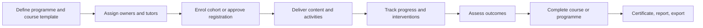

# ILIAS LMS and Training Management Concept

## intent

Evaluate ILIAS 11 as the learning environment and operational
training-management layer for programmes, courses, membership, content,
learning paths, learning progress, assessment, collaboration, and evidence of
completion.

## scope boundary

ILIAS is broader than a course player but should not be assumed to be a complete
student information or institutional administration system.

```text
Inside evaluation:
  programme/course structure, cohorts/membership, learning delivery,
  activities, progress, assessment, certificates, communication, permissions

Separate unless proved:
  admissions, statutory learner record, fees, contracts, enterprise timetable,
  HR/payroll, regulatory reporting, institution-wide master data
```

Official university examples explicitly connect ILIAS to campus-management
systems for course creation and learner assignment. That is evidence for an
integration boundary, not evidence that every institution needs a separate
system.

## training domain model

| Concept | Meaning to verify |
| --- | --- |
| Repository/category | Hierarchical organisation and delegated ownership of learning objects. |
| Study Programme | Structure for complete study/training paths and completion rules. |
| Course | Time-bounded or outcome-oriented learning delivery container. |
| Group | Persistent or ad-hoc learning community and membership boundary. |
| Organisational unit/role | Administrative scope and permission over users/content. |
| Member | Learner, tutor, course administrator, or local role within a container. |
| Learning object | File, page/module, SCORM package, exercise, test, survey, wiki, forum, portfolio, or external tool. |
| Precondition/learning sequence | Rule controlling order and availability of activities. |
| Learning progress | Status/marks/percent completion derived from configured activities. |
| Certificate/credential evidence | Completion output whose semantics and lifecycle must be tested. |

## target business workflow



## Docker evaluation baseline

- Pin the tested ILIAS release/tag; the official repository showed 11.2 as the
  latest release when this concept was written.
- Record source tag, image builder/repository, image digest, PHP/web-server
  versions, database version/config, enabled plugins, cron, search/RPC, mail,
  and persistent volumes.
- Compare the container stack with the official `release_11` installation
  requirements rather than trusting the image label alone.
- Treat any third-party image as evaluation infrastructure with its own supply
  chain and maintenance risk.
- Use synthetic users and content. Do not connect institutional SSO, mail, or
  real learner records during the first pass.
- Verify backup/restore across database, external data directory, web data, and
  config; the official guide identifies all three data areas plus the database.

## test dataset

- 2 organisational units or departments;
- 1 study programme with 2 pathways;
- 3 courses: scheduled instructor-led, self-paced, and blended;
- 4 roles: platform admin, programme/training admin, tutor, learner;
- 20 learners in 2 cohorts, including one late enrolment and one transfer;
- files/pages, one SCORM package, one exercise, one test, one forum, one survey,
  and one portfolio task;
- prerequisites that unlock different content based on completion or score;
- one certificate/completion output and one export/report requirement.

## scenario matrix

| ID | Scenario | Evidence to capture |
| --- | --- | --- |
| ILIAS-01 | Model departments, repository categories, programme, courses, and groups | Hierarchy, ownership, copying/templates, archive/offline behavior. |
| ILIAS-02 | Configure global and local roles | Effective permissions, delegation, denial paths, role-template maintainability. |
| ILIAS-03 | Enrol cohorts and manage membership | Self-registration, approval, waiting list, import, late join, transfer, withdrawal. |
| ILIAS-04 | Build scheduled, self-paced, and blended courses | Availability dates, calendar, sessions, content organisation, learner view. |
| ILIAS-05 | Create learning paths and preconditions | Completion/score rules, branching, reset behavior, export/import preservation. |
| ILIAS-06 | Deliver mixed learning objects | Native authoring, SCORM, exercise, test, forum, survey, portfolio, external/LTI object. |
| ILIAS-07 | Track learning progress and intervene | Tutor/programme views, learner view, manual corrections, auditability, stale status. |
| ILIAS-08 | Complete course/programme and issue evidence | Pass rules, certificate, expiry/renewal if present, revocation/correction, export. |
| ILIAS-09 | Test communication and operational administration | Announcements, scheduled mail, groups, tutor workflow, notifications, calendar. |
| ILIAS-10 | Establish system-of-record boundary | For each required training field/process: native owner, integration, plugin, customisation, or gap. |
| ILIAS-11 | Backup, restore, upgrade rehearsal | Database/files/config recovery and one minor-version update in a disposable clone. |
| ILIAS-12 | Accessibility and mobile learner pass | Keyboard/screen-size/basic assistive path for course, activity, test, and progress. |

## acceptance questions

- Can the organisation's programme/course/cohort structure be expressed without
  distorting terminology or creating an unmaintainable permission tree?
- Does Study Programme meet the required training-plan semantics, including
  prerequisites, equivalence, optional branches, expiry, and repeat training?
- Can training administrators operate across their organisational scope without
  becoming platform administrators?
- Are learning progress and completion rules explainable, correctable, and
  exportable?
- Which records remain authoritative in ILIAS, and which require an external
  training/SIS source of truth?
- Can course creation and enrolment be automated through supported interfaces
  without database writes?
- Does ILIAS's own Test tool satisfy ordinary formative assessment, leaving TAO
  only for higher-governance or large-scale exams?
- What is the ongoing upgrade/plugin/container maintenance burden?

## quality and security checks

- permission inheritance and local-role denial tests;
- personal data visibility across organisational units;
- upload/content sanitisation and executable-content boundaries;
- session/cookie/HTTPS configuration in the chosen stack;
- cron, mail, search, certificate, and background-service failure visibility;
- backup/restore consistency across database and file stores;
- plugin provenance, supported-version range, and upgrade failure path;
- representative course-page and progress-report response times.

## non-claims

- Study Programmes and course management do not automatically make ILIAS a
  complete SIS, registrar, fee, HR, or enterprise scheduling system.
- A community Docker image is not proof of an officially supported production
  deployment.
- Standards support does not guarantee lossless TAO interoperability.
- Built-in e-exams do not make TAO unnecessary until the specialist exam
  scenarios are compared directly.

## related

- [TAO–ILIAS evaluation frame](tao-ilias-evaluation-frame.md)
- [Research record](../../../reports/research/2026-07-16-tao-ilias-training-platform-evaluation.md)

