# TAO Assessment Platform Concept

## intent

Evaluate TAO Community Edition as the specialist engine for authoring,
organising, delivering, monitoring, scoring, and reporting examinations.

## scope boundary

TAO is assessment-first, not the proposed source of truth for programmes,
courses, tuition, admissions, or general learner development. Its published
assessment cycle is:

```text
Rostering -> Authoring -> Delivery -> Results
```

The Docker test targets **TAO Community Edition**. The shared TAO documentation
also describes Portal, Advance, Grader, and Insights. A feature counts as CE
evidence only when it is observable in the pinned CE installation or explicitly
documented for CE.

## examination domain model

| Concept | Meaning to verify |
| --- | --- |
| Item/interaction | A question or task, response declaration, scoring rule, media, and metadata. |
| Item bank/content bank | Reusable, classified assessment material with access control and import/export. |
| Test | Ordered or structured assembly of items, sections, navigation, timing, and tools. |
| Delivery | Published/frozen executable form of a test. |
| Candidate/test-taker | Person eligible to sit a delivery in a session. |
| Group/roster | Candidate grouping and assignment input. |
| Session | Scheduled operational use of a delivery or battery with availability and access controls. |
| Attempt/test session | One candidate's interaction with the delivered test. |
| Proctor/monitor | Role that authorises, observes, and intervenes in a live session where supported. |
| Result | Responses, outcomes, scores, status, timing, and audit context produced by delivery. |

## target business workflow

```mermaid
flowchart LR
    A[Build and classify items] --> B[Assemble and preview test]
    B --> C[Approve content]
    C --> D[Publish frozen Delivery]
    D --> E[Create roster and session]
    E --> F[Authorize and monitor candidates]
    F --> G[Submit or recover attempt]
    G --> H[Automatic and human scoring]
    H --> I[Review, release, report, export]
```



The test must reveal where TAO CE has a native approval/versioning boundary and
where the institution would need an external procedure.

## Docker evaluation baseline

- Use the official TAO CE Docker Compose path.
- Record compose URL/commit, image names and digests, container versions,
  enabled extensions, database volumes, and host resources.
- Allocate at least the official evaluation minimum; record actual CPU/RAM.
- Change all default administrator and demo-user passwords before functional
  testing.
- Keep the environment non-production and isolated from real learner data.
- Take a clean database/volume checkpoint before scenario testing.

## test dataset

Create synthetic data only:

- 2 organisational units or candidate groups;
- 4 roles: administrator, item author/test manager, proctor/scorer, candidate;
- 30 items covering single choice, multiple response, numeric, essay/manual
  score, media, and one accessibility/accommodation case;
- metadata by subject, difficulty, outcome, author, and status when supported;
- 3 tests: fixed-form, section/randomisation case, and mixed auto/manual score;
- 20 candidates divided across two groups;
- 2 sessions with different time windows and access rules.

## scenario matrix

| ID | Scenario | Evidence to capture |
| --- | --- | --- |
| TAO-01 | Create, classify, search, copy, revise, import, and export items | Metadata, permissions, version behavior, QTI round trip, lost fields. |
| TAO-02 | Assemble sections, timing, navigation, ordering/randomisation, scoring, and preview | Configuration export/screenshots and preview-versus-delivery parity. |
| TAO-03 | Approve and publish a test as a Delivery | Mutability after publish, frozen-version identity, republish behavior, audit trace. |
| TAO-04 | Import candidates, assign groups, and create sessions | Required roster fields, duplicate handling, timezone, access code, attempt rules. |
| TAO-05 | Run a supervised session | Candidate admission, live status, pause/resume, intervention, late/duplicate login behavior. |
| TAO-06 | Exercise failure paths | Browser close, network interruption, timeout, abandoned attempt, server restart, recovery. |
| TAO-07 | Score mixed responses | Automatic score, rubric/manual score, anonymous/double marking if present, correction and audit. |
| TAO-08 | Review and publish results | Candidate review controls, release timing, CSV/export/API data, item/test statistics. |
| TAO-09 | Verify roles and segregation of duties | Denial evidence for candidate, author, proctor, scorer, and administrator boundaries. |
| TAO-10 | Identify edition boundary | For every expected feature: CE present, CE absent, plugin, deprecated Core flow, or commercial module. |

## acceptance questions

- Can a test be frozen, identified, and traced independently from later edits?
- Can exam sessions be modelled without custom code for the institution's
  normal scheduling, admission, monitoring, incident, and completion states?
- Are proctor and scorer duties separable from content author and administrator?
- Can interrupted attempts be recovered without corrupting responses or
  creating ambiguous attempts?
- Is manual scoring governable and auditable in CE?
- Are result exports sufficient for ILIAS or another training system of record?
- Which required functions exist only in paid TAO products?
- What does AGPLv3 imply for intended modifications and network delivery?

## quality and security checks

- concurrent login and submission behavior at a small reproducible load;
- response durability during network/server interruption;
- clock/timezone consistency and timeout enforcement;
- role denial tests and direct-URL access attempts;
- exported personal/result data and retention/deletion controls;
- audit visibility for test publication, session intervention, score changes,
  and result release;
- backup/restore of configuration, content, candidate, attempt, and result data.

## non-claims

- Shared documentation does not prove Portal, Advance, Grader, or Insights are
  part of the tested CE installation.
- Deprecated TAO Core Test Center documentation does not prove a current CE
  test-centre workflow.
- A successful 20-user Docker scenario does not prove production capacity.
- QTI/LTI claims do not prove lossless interoperability with the selected ILIAS
  version until round-trip tests pass.

## related

- [TAO–ILIAS evaluation frame](tao-ilias-evaluation-frame.md)
- [Research record](../../../reports/research/2026-07-16-tao-ilias-training-platform-evaluation.md)

