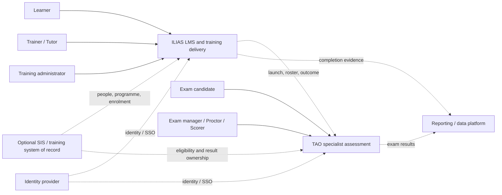

# TAO–ILIAS Evaluation Frame

## intent

Determine, with comparable Docker evidence, whether the training platform
should use ILIAS alone, combine ILIAS with TAO for specialist examinations, or
place both behind a separate training/SIS source of truth.

## source of truth and packs

- Human intent: TAO is evaluated for examination operations; ILIAS for LMS plus
  training administration.
- Research: [2026-07-16 TAO and ILIAS evaluation](../../../reports/research/2026-07-16-tao-ilias-training-platform-evaluation.md).
- Packs: Architecture, Contracts, Security Deep, Platform/Operations, and Math
  recommendation/measurement rules.

## candidate context



Dashed connections are hypotheses to test, not accepted contracts.

## options and trade-offs

### Option A — ILIAS only

Use ILIAS for learning, training administration, formative assessment, and
e-exams.

- Best when exam governance is moderate and ILIAS Test satisfies authoring,
  delivery, proctoring, scoring, audit, recovery, and scale needs.
- Lowest integration and operational cost.
- Risks coupling high-stakes exam change windows to the LMS and accepting a
  shallower specialist assessment model.
- Revision trigger: any mandatory TAO scenario that ILIAS cannot meet without
  risky customisation.

### Option B — ILIAS plus TAO

Use ILIAS for programmes/courses/progress and TAO for specialist or high-stakes
examinations.

- Preserves specialist exam capabilities and separates exam operations from
  ordinary learning activities.
- Adds identity, roster, launch, result, reconciliation, support, upgrade, and
  incident boundaries.
- Preferred evaluation hypothesis when examination governance is a first-class
  domain, but not yet an adoption recommendation.
- Revision trigger: integration or operating cost exceeds the demonstrated exam
  benefit, or ILIAS meets all exam scenarios natively.

### Option C — Training/SIS source of truth plus ILIAS and TAO

Keep authoritative people, programme, enrolment, eligibility, and award records
in a separate system; use ILIAS and TAO as delivery engines.

- Best when institution-wide administration, statutory records, fees,
  scheduling, or multiple delivery systems must share master data.
- Clearer long-term ownership but highest architecture, integration, security,
  reconciliation, and operations cost.
- Do not adopt merely because ILIAS is not a full SIS; first prove that the
  required master-data workflows exist.
- Revision trigger: a durable cross-system source-of-truth need with a named
  owner and consumers.

## provisional ownership questions

Do not integrate until each row has one owner.

| Data/process | Candidate owner | Decision evidence |
| --- | --- | --- |
| Person identity and lifecycle | IdP or training/SIS | Joiner/mover/leaver and duplicate-account tests. |
| Programme/catalogue | ILIAS or training/SIS | Required programme semantics and external consumers. |
| Course offering/cohort | ILIAS or training/SIS | Scheduling, capacity, enrolment, reporting boundaries. |
| Learning content/activity | ILIAS | Authoring, versioning, access, archive/export tests. |
| Item/test bank | TAO for specialist exams; ILIAS for course tests | Reuse, governance, QTI fidelity, ownership workflow. |
| Exam eligibility/roster | training/SIS, ILIAS, or TAO | Source, approval, late change, reconciliation scenarios. |
| Exam attempt/responses | TAO | Durability, recovery, audit, retention, correction tests. |
| Learning progress | ILIAS | Explainability, recalculation, manual correction, export. |
| Official result/award | undecided | Appeal/correction, legal record, transcript/report consumers. |

## comparable Docker protocol

1. Pin edition, version/tag, image source/digest, plugins, compose/config, and
   host resources.
2. Use the same 20 synthetic people and shared identifiers in both systems.
3. Run each system's native workflow first; do not force TAO concepts into
   ILIAS or ILIAS course concepts into TAO.
4. Execute the individual scenario matrices and record screen/config evidence,
   elapsed operator time, errors, custom steps, and unresolved questions.
5. Run one equivalent ordinary course test in both systems.
6. Attempt QTI export/import in both directions and list semantic loss; do not
   score only “file imported”.
7. If supported, test an LTI-style launch/return path with synthetic identity;
   record the exact standard/version and claim mapping.
8. Rehearse backup/restore and one service interruption before comparing UX.
9. Separate native capability, configuration, plugin, integration, custom code,
   paid edition, and unsupported workaround in every result.
10. Decide only after the evidence ledger and ownership table are complete.

## evidence ledger template

| Scenario | System/edition/version | Native/config/plugin/custom/paid | Result | Operator time | Evidence path | Gap or follow-up |
| --- | --- | --- | --- | --- | --- | --- |
| | | | pass / partial / fail / blocked | | | |

## decision dimensions

Do not invent one weighted score yet. Compare the vector:

- functional fit for learning and examination workflows;
- workflow clarity and operator effort;
- exam integrity, audit, recovery, and segregation of duties;
- learner, tutor, training-admin, exam-ops, and support usability;
- standards/integration fidelity and data ownership;
- accessibility and Vietnamese localisation effort;
- deployment, backup, upgrade, plugin, and monitoring burden;
- licensing and customisation obligations;
- performance/resource behavior on pinned workloads;
- exit/export and long-term maintainability.

Hard constraints are pass/fail. Trade-offs are discussed only among feasible
options.

## human-confirm gates

No gate has been passed for:

- adopting either system;
- selecting Option A, B, or C;
- assigning authoritative data ownership;
- selecting SSO, API, LTI, QTI, or result contracts;
- choosing third-party Docker images for production;
- adding plugins or customising either product.

The next human decision should occur after the first Docker evidence review,
not before installation.

## Math Pack side review

The current Math Pack should remain one pack. Reasoning navigation and proof
techniques already cover the operational inference loop and core quantified
claim forms. The missing formal-logic material should first become one file
inside `wiki/knowledge/math/`, not a new top-level folder.

Proposed future file:

```text
formal-logic-and-inference.md
  - syntax, semantics, models, validity, satisfiability
  - propositional and predicate inference rules
  - necessary/sufficient conditions and common fallacies
  - deduction, induction, abduction, defeasible evidence boundaries
  - SAT/SMT/proof-assistant routing and verification limits
```

Split into `math/logic/` only after at least three real consumers require
separate guides, for example formal logic, temporal/workflow logic, and
SAT/SMT/automated reasoning. This avoids a premature folder with one file while
leaving a clear growth path.

## validation needed before acceptance

- completed TAO and ILIAS scenario matrices;
- reproducible compose/config and pinned version evidence;
- role/permission denial tests and security notes;
- QTI/LTI or alternative integration fidelity results;
- backup/restore and failure-recovery evidence;
- data ownership proposal with one owner per record/process;
- explicit operator and learner feedback;
- option comparison with constraints, costs, uncertainty, and revision trigger.

