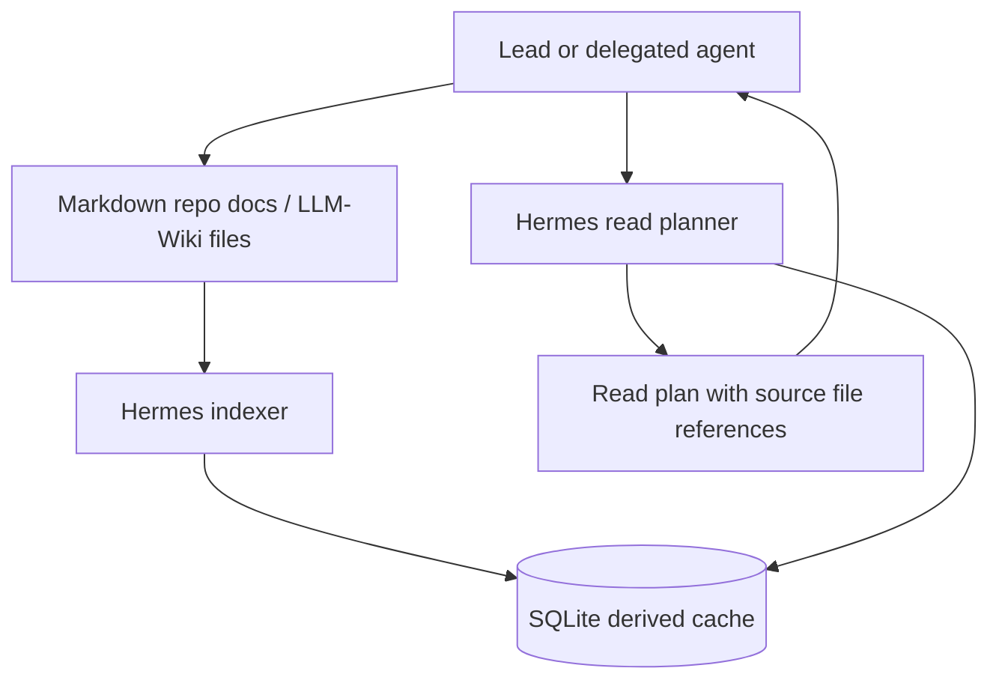

# Hermes context indexer

## purpose

Hermes is an optional project capability for reducing agent read cost.

Hermes acts as:

- context indexer;
- read planner;
- source-of-truth risk detector;
- Knowledge Lookup Metric helper;
- section and line-range locator.
- shared-file delegation and section-lock risk detector.

Hermes is not:

- an implementation agent;
- a source of truth;
- a code editor;
- a rule owner;
- a project status owner.
- a write-lock authority.
- a draft content store.

## authority model

Use this order when Hermes is enabled:

```text
Current user / Lead assignment / integration-owner assignment
  > repo docs and code
  > LLM-Wiki reusable knowledge when consulted by rule
  > Hermes derived index/cache/read plan
```

Hermes output is advisory. If Hermes and a source file disagree, the source file
wins and Hermes must be treated as stale until re-indexed.

## default architecture



## SQLite boundary

Hermes may store derived data such as:

- file path, size, mtime, content hash, and git commit;
- heading index and anchors;
- section start and end lines;
- section hashes;
- task ids, states, owners, and packet anchors;
- required read files;
- allowed and forbidden write targets;
- per-agent `AGENT.md` control-card section anchors;
- coordination mode, review target, integration owner, and shared-file write
  delegation fields from `AGENT.md`;
- shared-file section/row locks declared by task packets or control cards;
- read-plan cache;
- FTS or embedding indexes.

Hermes must not be the canonical store for:

- tasks;
- decisions;
- project status;
- contracts;
- draft/proposed content;
- shared-file lock ownership;
- implementation plans;
- repo rules;
- source code.

If a project deliberately chooses a Hermes-first design, that is a separate
architecture decision. Generated Markdown must then be marked as generated and
manual edits to generated files must be forbidden. That is not the default
LLM-Wiki pattern.

## project adoption rule

Do not enable Hermes just because a project exists. Enable it when at least one
of these is true:

- agent bootstrap reads are repeatedly too large;
- project has several active agents;
- task/status files are long even after current cards and archives are used;
- cross-file lookup is frequent and error-prone;
- agents repeatedly read the wrong source-of-truth file;
- Human-orchestrated mode uses shared-file write delegation across several
  agents;
- Knowledge Lookup Metric scoring often reaches the consult range.

LLM-Wiki itself should not depend on Hermes until at least two real projects
have piloted Hermes and produced measurement evidence.

## required project files

When Hermes is enabled for a repo, add:

```text
docs/hermes.md
docs/hermes_read_plan.md
```

Optional implementation-owned files may include:

```text
.hermes/config.json
.hermes/hermes.sqlite
```

The SQLite database is build/cache output. The project must decide whether it
is ignored, regenerated in CI, or stored as an artifact. Do not treat it as a
reviewed source file unless the project has accepted a Hermes-first ADR.

## read plan output

Hermes read plans should include:

- request type;
- source of truth;
- risk lane;
- Knowledge Lookup Metric score when relevant;
- files and line ranges to read first;
- files to read only if escalated;
- files not to read;
- cache freshness;
- conflict or stale-cache risks;
- shared-file delegation/section-lock risks when relevant;
- recommended next actor.

Use `templates/hermes_read_plan.template.md` as the skeleton.

## stale cache rule

Hermes must compare cached metadata against source files before returning a
plan. At minimum, check file size, mtime, and content hash. When metadata does
not match, Hermes must re-index or mark the plan `stale`.

Agents must not act on a stale Hermes read plan without reading the source file.

## forbidden actions

Hermes must not:

- edit code;
- edit docs;
- update rules;
- update task state;
- roll up agent reports;
- accept or reject delegated work;
- resolve conflicts;
- grant write permission or lock ownership;
- make source-of-truth decisions without human, Lead, or integration-owner
  review.

## shared-file delegation support

When a project uses Human-orchestrated mode, Hermes may help by indexing
declared shared-file write delegations:

```text
Shared-file write delegation:
- File:
- Section/rows:
- Operation:
- Lock owner:
- Review target:
- Rollback note:
```

Hermes may warn when:

- two active agents claim the same file section/row;
- a delegated agent plans to write a shared file with no delegation;
- the cached section line range is stale;
- the review target or integration owner is missing;
- the write target conflicts with a forbidden target.

Hermes must not create, approve, transfer, or clear locks. The source Markdown
task/control files remain canonical, and the human, Lead, or integration owner
decides.

## draft staging boundary

When two or more agents want to write the same file section/row, do not use
Hermes SQLite/cache as a temporary draft store.

Allowed flow:

```text
Agent A -> AGENT.md result handoff or reports/agent/A/...
Agent B -> AGENT.md result handoff or reports/agent/B/...
Hermes  -> index overlap/stale/lock risk
Integration owner -> writes reports/integration/<task-id>-merge-plan.md when needed
Integration owner -> updates the canonical source file after review
```

Hermes may index proposal/report paths, section anchors, hashes, and overlap
risks. It must not store proposed Markdown bodies as the place an agent or
integration owner relies on for later merge.

Use Markdown staging for proposed content:

```text
agents/<agent>/AGENT.md                         short handoff/proposal
reports/agent/<agent>/<task-id>-result.md       durable agent evidence
reports/integration/<task-id>-merge-plan.md     merge plan for multiple outputs
```

Same-file rule:

- same file, different delegated section/row lock: agents may work in parallel;
- same file, same section/row: agents submit proposals only;
- same file, same section/row: integration owner chooses/merges and updates the
  canonical source file;
- Hermes warns; it does not merge.

## pilot measurement

Each project pilot should record:

- baseline lines/tokens read before Hermes;
- lines/tokens read after Hermes;
- stale-cache incidents;
- wrong-file recommendations;
- source-of-truth conflicts caught;
- agent time-to-first-edit when measurable.

Use the project result reports or validation reports for evidence. File back a
reusable lesson only after the pilot has evidence beyond a single conversation.

## common mistakes

| Mistake | Fix |
| --- | --- |
| Treating SQLite as the task board | Keep Markdown source files canonical; default delegated state lives in `agents/<agent>/AGENT.md` |
| Using Hermes cache as draft storage | Store proposals in `AGENT.md`, `reports/agent/`, or `reports/integration/` |
| Letting Hermes choose source of truth | Hermes reports risk; Lead decides |
| Treating Hermes lock warnings as permission | Human/Lead/integration owner grants permission in Markdown source files |
| Using Hermes to avoid source reads entirely | Hermes points to exact source slices |
| Enabling Hermes before file cards/indexes exist | Add current cards and section indexes first |
| Applying Hermes to LLM-Wiki before pilots | Pilot in real projects, measure, then decide |
